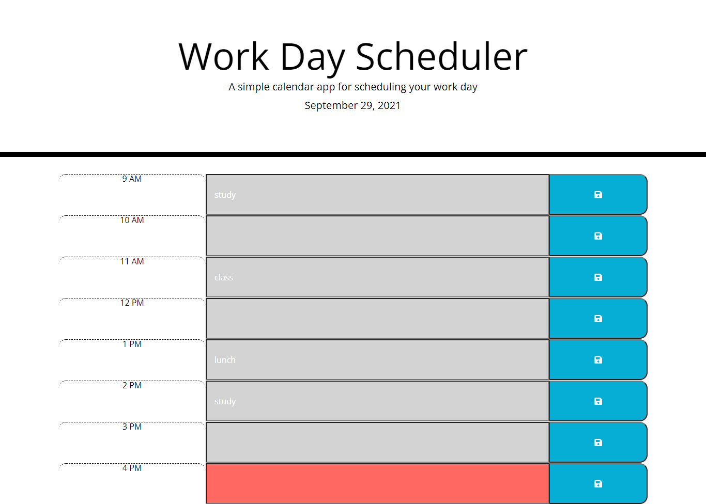

# 05-third-party-apis-work-day-scheduler
Bootcamp Homework #5

## Objective

Created a work day scheduler that displays the current date, shows existing events, allows user to save new events on the hour, and color codes hours by past, present, and future. 

## Screen Shot

## Link to deployed page

[Here is the link to my deployed code.](https://ljhofer.github.io/05-third-party-apis-work-day-scheduler//)
