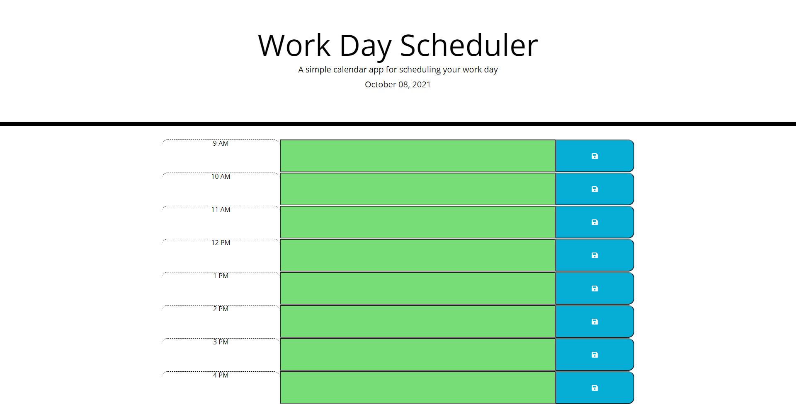

# 05-third-party-apis-work-day-scheduler
Bootcamp Homework #5

## Objective

Created a work day scheduler that displays the current date and shows existing events. It allows user to save new events on the hour and color codes hours by past, present, and future. 

## Screen Shot

## Screen Shot

## Link to deployed page

[Here is the link to my deployed code.](https://ljhofer.github.io/05-third-party-apis-work-day-scheduler//)

## Tech Stack
HTML, CSS, Bootstrap, jQuery, Moment.js

## Contributor
Laura Hofer GitHub: ljhofer
